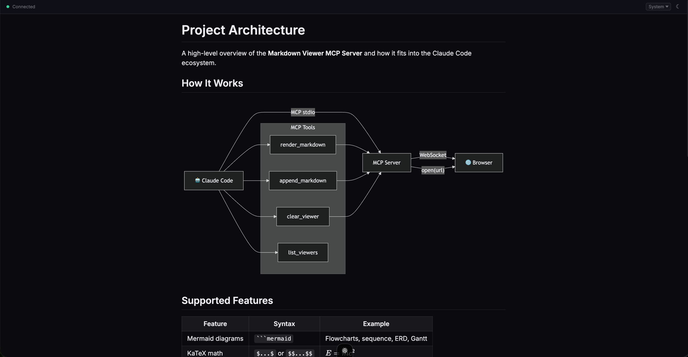

# Markdown Viewer MCP Server

An MCP server and a CLI that render markdown in a browser window with live updates. Supports Mermaid diagrams, KaTeX math, syntax-highlighted code blocks, tables, images, and GitHub-flavored markdown.



## The command line

The same viewer, without MCP. Agents and scripts that never speak MCP — a shell, a
sandboxed coding agent, CI — reach it through the `mdv` binary:

```bash
npx mcp-markdown-viewer render plan.md            # opens http://localhost:7391/
mdv render review.md --path /review               # a second page, its own tab
mdv render - --path /scratch < notes.md           # render stdin
mdv list                                          # pages with content
mdv clear /review                                 # drop one page ('*' clears all)
mdv stop                                          # end the detached viewer
mdv serve                                         # hold the viewer open, no render
```

Commands are one-shot: the first `render` starts a detached viewer process that
outlives it — the same election and the same pages the MCP server uses, so a
tab an MCP session opened is the tab the CLI pushes to. `--no-open` skips the
browser (the viewer serves the page anyway), which is what scripts and CI want;
`MDV_NO_OPEN=1` says the same thing by environment.

| Variable | Effect |
|---|---|
| `MDV_PORT=<n>` | Share on port `<n>` instead of 7391. |
| `MDV_NO_OPEN=1` | Never launch a browser; just serve. |

`mdv render -` reads stdin, through a temp file in the working directory so
relative image paths resolve the way they would if the pipe had been a file.

## Install

Add to your Claude Code MCP settings (`~/.claude/settings.json`):

```json
{
  "mcpServers": {
    "markdown-viewer": {
      "command": "npx",
      "args": ["-y", "mcp-markdown-viewer"]
    }
  }
}
```

Or to a project-level `.mcp.json`:

```json
{
  "mcpServers": {
    "markdown-viewer": {
      "command": "npx",
      "args": ["-y", "mcp-markdown-viewer"]
    }
  }
}
```

The server binds to loopback only and opens browser tabs automatically when content is rendered.

## One viewer, shared by every session

MCP servers run over stdio, so your editor starts a separate server process for
each session. They still share a single viewer: on startup each process tries to
bind port **7391**, and whichever one wins serves the pages. The rest become thin
clients and push their renders to it over loopback. The port is the lock — there
is no daemon and no lock file.

What this buys you:

- **The URL never changes.** `http://localhost:7391` is stable for as long as any
  session is alive, so a bookmarked tab keeps working.
- **One tab per page path**, not one per session. A tab is opened only when a page
  has no live viewer attached, which also means closing a tab and re-rendering
  brings it back.
- **Every session sees the same pages.** `list_viewers` and `clear_viewer` act on
  the shared set, whichever session calls them.

When the process that owns the port exits, the next render from any other session
takes the port over. The page reconnects on its own — it retries with backoff and
is sent the current content on connect — so the tab recovers at the same URL.
Pages whose content lived only in the departed process come back blank until
something renders them again.

| Variable | Effect |
|---|---|
| `MDV_PORT=<n>` | Share on port `<n>` instead of 7391. |
| `MDV_PORT=0` | Don't share — take a private random port, as versions before 1.5.0 did. |
| `MDV_NO_OPEN=1` | Never launch a browser; just serve. Useful over SSH and in CI. |

If port 7391 is held by an unrelated program, the server says so and falls back to
a private random port rather than talking to a stranger — it identifies siblings
with a handshake on `/__mdv/health` first.

Since the port is well-known, every way into the server is pinned to loopback: the
control endpoints require a loopback `Host` header (which is what blocks DNS
rebinding), a same-origin fetch, and a JSON content type, and the WebSocket that
carries the page content refuses any upgrade whose `Origin` or `Host` isn't
loopback. A page you happen to have open on some other local port cannot read
your rendered documents.

## Images

Standard markdown image syntax works, including local files — the server reads
them off disk and serves them to the page, since a browser can't load a
filesystem path from an `http://` document.

```markdown


```

Relative paths resolve against **the rendered file's own directory**, so a doc
that references `./diagrams/flow.png` renders the way it reads on disk.

Behaviour worth knowing:

- An image that is a block of its own is centred, framed, and **click-to-zoom**
  (Escape or click to dismiss) — the 860px text column downscales most
  screenshots past readability. Inline images, like badges, are left alone.
- A path that doesn't resolve renders as a placeholder naming the path that
  failed, rather than a bare broken-image glyph.
- PDF export waits for images to decode before measuring the page, so exports
  aren't truncated.
- Images are served with `Cache-Control: no-store`, so re-rendering picks up a
  regenerated chart or screenshot without a hard reload.

Only image file types are served (`png`, `jpg`, `jpeg`, `gif`, `webp`, `svg`,
`avif`, `bmp`, `ico`, `apng`, `tif`, `tiff`), up to 32MB, over loopback only,
and cross-site requests are refused. `/__mdv/*` is reserved for the viewer's own
endpoints and can't be used as a page path.

## Getting Claude to use it automatically

Claude won't use the viewer unless you tell it to. Add something like this to your `CLAUDE.md` (global or project-level):

```markdown
## Markdown Viewer

When presenting plans, architecture designs, code reviews, or any structured analysis,
write the content to a markdown file first and then use the `render_file` tool to render
it in the browser viewer. The `render_file` tool takes a `file` path argument and an
optional `path` for the viewer tab. Don't wait to be asked — render proactively whenever
the output would benefit from rich formatting, diagrams, or tables.

Use Mermaid diagrams liberally to visualize architectures, flows, data models, and
relationships. The viewer supports:
- Mermaid diagrams (flowcharts, sequence, ERD, Gantt, etc.)
- Syntax-highlighted code blocks
- KaTeX math ($inline$ and $$display$$)
- Tables, blockquotes, task lists
- Images, including local file paths — 
- Dark/light theme with font selection

Use `path` to organize content into separate tabs (e.g. `/plan`, `/review`, `/debug`).
```

## Install from source

```bash
git clone https://github.com/Mykhol/markdown-mcp.git
cd markdown-mcp
npm install
npm run build
```

Then point your MCP config at the built file:

```json
{
  "mcpServers": {
    "markdown-viewer": {
      "command": "node",
      "args": ["/path/to/markdown-mcp/dist/server.js"]
    }
  }
}
```

## License

MIT
